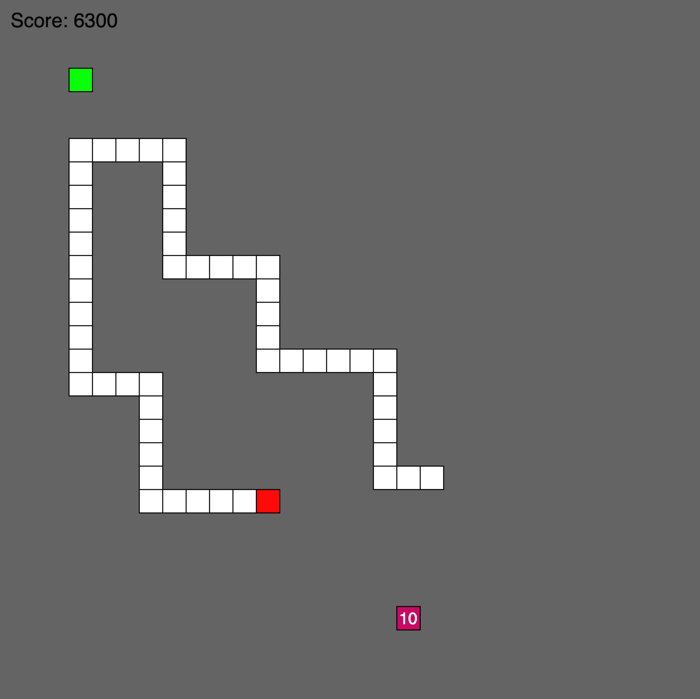

# A Simple Snake Game in p5.js
*This is a simple snake game created using the p5.js javascript library.*

This simple Javascript/p5.js game is a recreation of the popular snake game. The game features a snake that can eat pieces of food to gain points and grow in size(length). There are two pieces of food, one normal piece of food (green) and a special *super food* that appears in the game at random times and disapears after a short while. This super food item gives more points of eaten before it goes away. The game is controlled using the arrows.

## How to run the game
The entire game consist of only one very simple HTML file, that basically just loads the other file which is a Javascript file where the game is written. The program can be run in several ways, but the easiest is probably to use the node.js program called live-server. This program can be installed using the **npm** (node package manager). When installed simply navigate to the folder in which the files in this repository are stored, using the terminal, and then type the command **live-server** (at least this works on MacOS).

